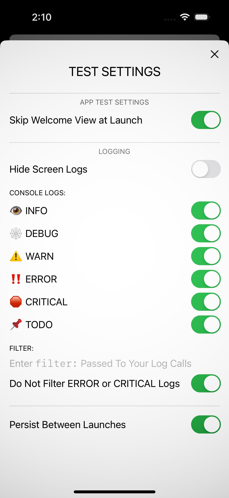

# **`DurableTestHarness`** Swift Package

## Overview
A framework for aiding the **development and testing of SwiftUI apps**.

**A Demo app is included** with the package that shows you how to enable and use the test harness. See the `DemoApp.swift` file to get started.

Further details and a more complete descriptions can be found here:
https://www.durablebrand.software/random-access/swiftui-test-harness

## Installation
This code is provided as **Swift Package** that you can add to your Xcode project's "Package Dependencies" using the following URL:

<code>https://github.com/durablebrandsoftware/durable-test-harness</code>

Add the following import to your Swift source files to access its features:

`import DurableTestHarness`

  

